# ONLINE CLOTHING SHOP
## Introduction
Online clothing shop with features
- Login, logout, register, change password.
- Search product, add to cart.
- Order, payment with VNPay.
- Manage product, account, order.
- Statistical data.
## Languages and technologies used
1. C# (.Net MVC)
2. SQL
3. HTML/CSS
4. JavaScript
## Softwares used
1. Visual studio code (code editer)
2. Google Chrome (was used to run the website of project)
## Getting into the project
1. Home page
   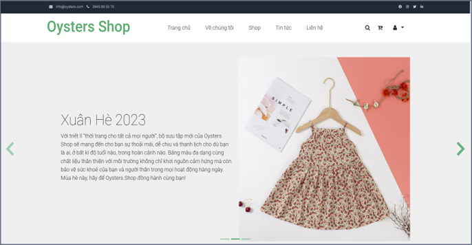
2. Register page
   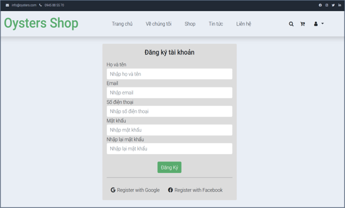
3. Login page
   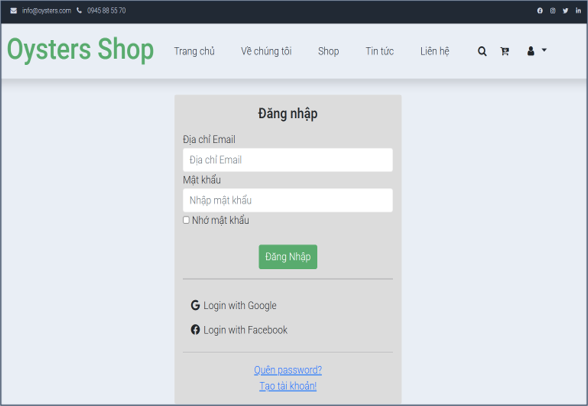
4. Login success
   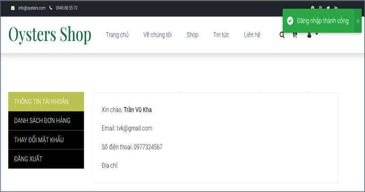
5. Change password page
   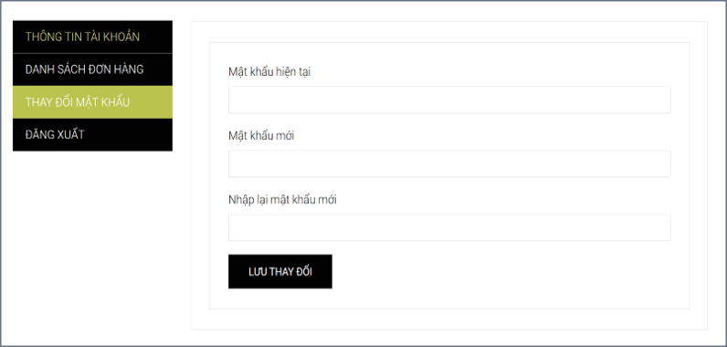
6. Menu page
   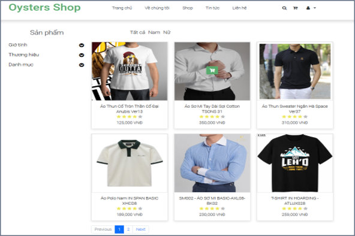
7. Detail product
   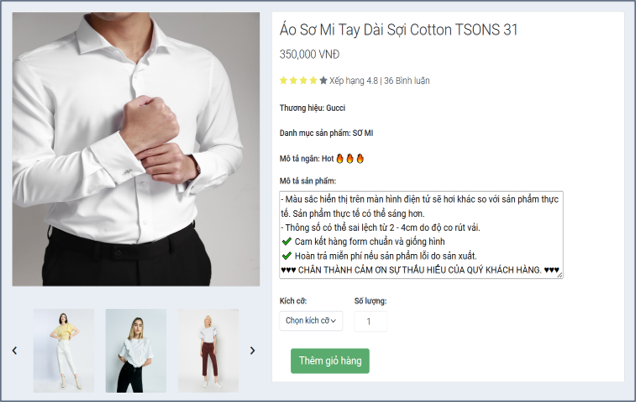
8. Shopping cart
   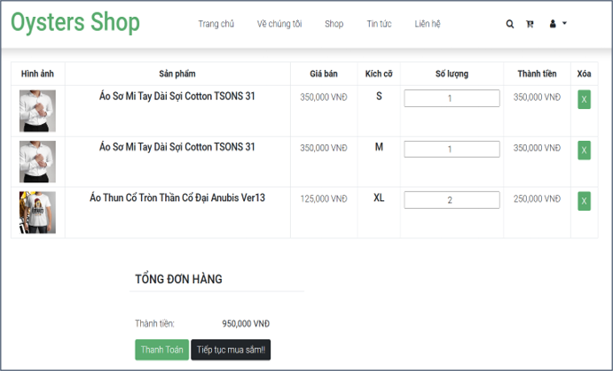
9. Payment page
    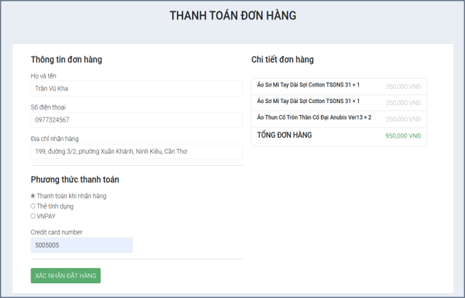
10. Payment with VNPay
    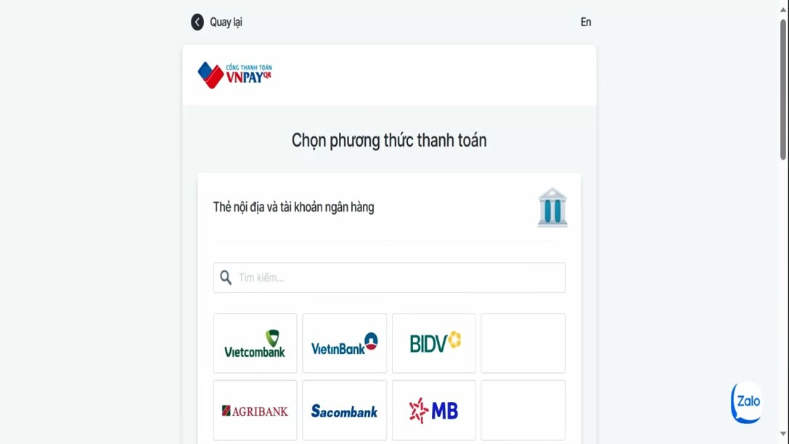
11. News page
    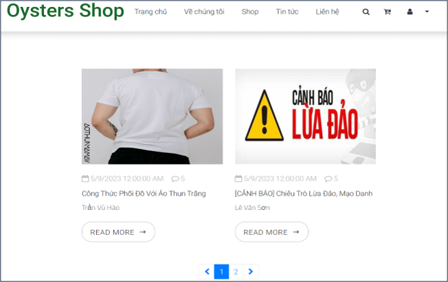
12. Admin login page
    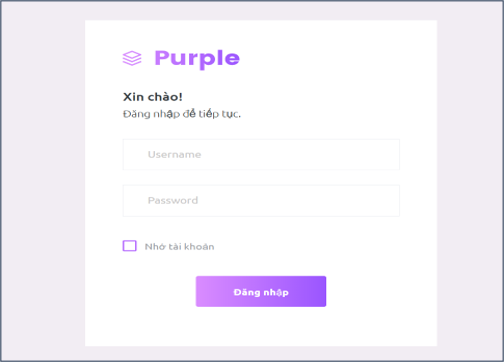
13. Admin home page
    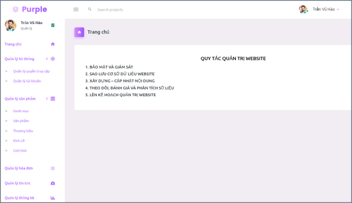
14. Account manage
    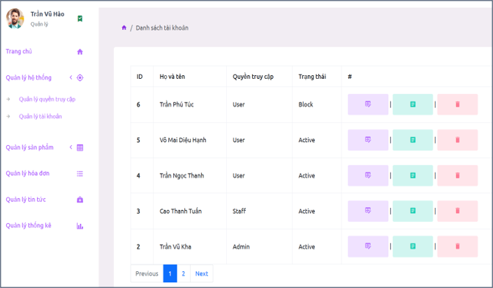
15. Product manage
    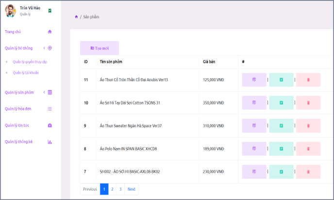
16. Add product
    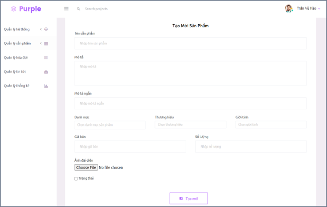
17. Edit product
    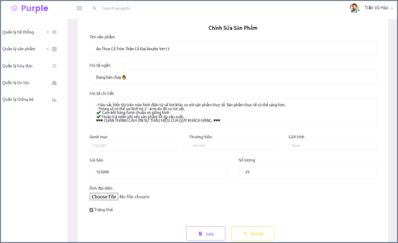
18. View detail product
    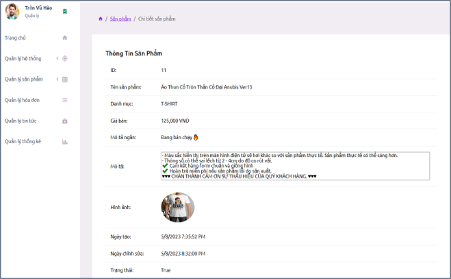
19. Delete product
    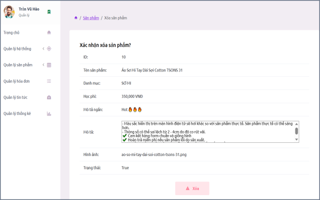
20. Order manage
    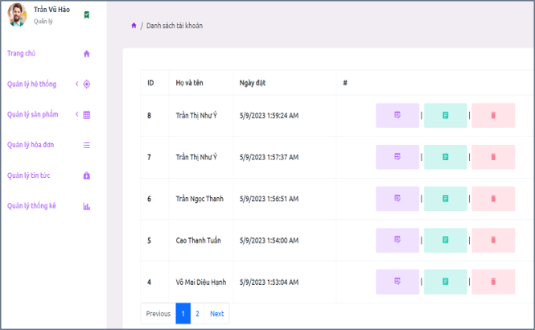
21. Update status of order
    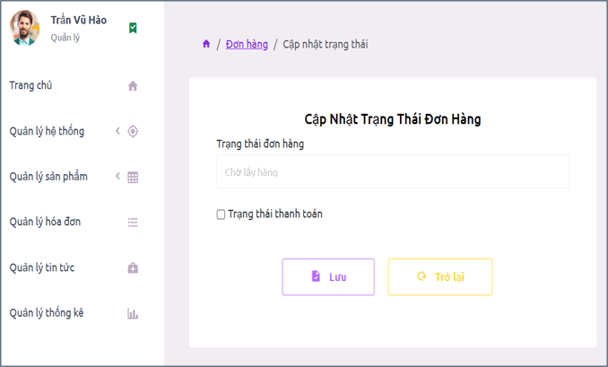
22. Order Information
    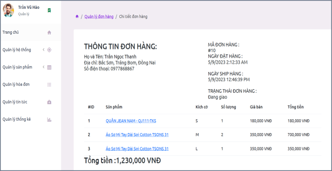
23. Add news
    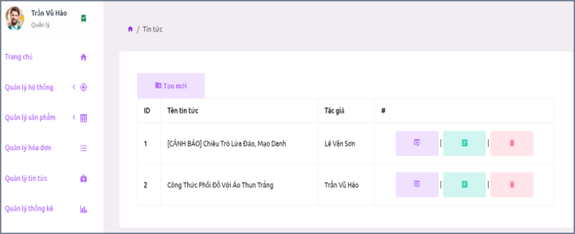
24. Statistical data
    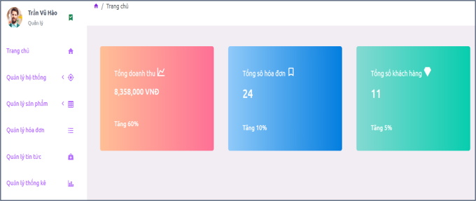

